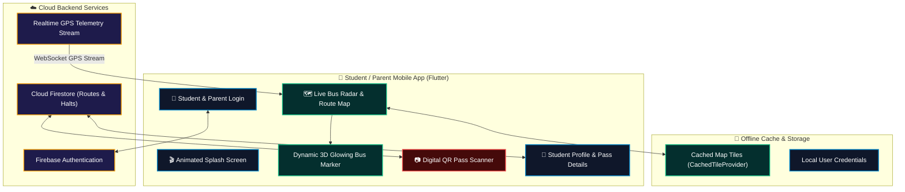

<div align="center">

<!-- HERO BANNER -->


<br/>

<!-- BADGE SHIELDS ROW 1 -->
[](https://flutter.dev)
[](https://dart.dev)
[](https://firebase.google.com)
[](https://developer.android.com)
[](https://developer.apple.com)

<!-- BADGE SHIELDS ROW 2 -->
[](https://pub.dev/packages/flutter_map)
[](https://pub.dev/packages/mobile_scanner)
[](LICENSE)

<br/>

<p align="center">
  <a href="#-overview"><b>Overview</b></a> •
  <a href="#-mobile-system-architecture"><b>Architecture</b></a> •
  <a href="#-core-mobile-screens"><b>App Screens</b></a> •
  <a href="#-key-features"><b>Features</b></a> •
  <a href="#-quick-start"><b>Quick Start</b></a>
</p>

---

</div>

## 📡 Overview
**SISTCAP Student Bus App** is a cross-platform Flutter mobile application designed for students and parents. It bridges the gap between campus transport fleets and commuters by providing **real-time sub-second bus GPS radar tracking**, **dynamic glowing vehicle heading markers**, **digital QR boarding passes**, and **offline map tile caching**.

---

## 🏗️ Mobile System Architecture


---

## 📲 Core Mobile Screens & Workflow
```
+--------------------------------------------------------------------------------------------+
¦  LIVE BUS RADAR MAP       ¦  DIGITAL QR BOARDING      ¦  STUDENT PROFILE          ¦
+------------------------------+------------------------------+------------------------------¦
¦ • Real-Time Bus Coordinate   ¦ • Instant QR Pass Scanner    ¦ • Route & Assigned Bus ID    ¦
¦ • Custom 3D Glowing Marker   ¦ • Automated Attendance Log   ¦ • Emergency Campus SOS       ¦
¦ • ETA to Next Campus Stop    ¦ • Anti-Fraud Pass Token      ¦ • Parent Contact Link        ¦
¦ • Offline Tile Caching       ¦ • Sound & Haptic Feedback    ¦ • Notification Preferences   ¦
+--------------------------------------------------------------------------------------------+
```

---

## 🧩 Key Capabilities & Innovation
<table>
  <tr>
    <td width="50%" valign="top">
      <h3>🗺️ Live Sub-Second GPS Radar</h3>
      <ul>
        <li><b>Glowing Vector Bus Marker:</b> Dynamic heading rotation and smooth coordinate interpolation without jumping.</li>
        <li><b>Speed & Signal Health:</b> Real-time indicators showing vehicle speed, route delay, and connectivity state.</li>
        <li><b>OpenStreetMap Engine:</b> High-definition vector rendering powered by <code>flutter_map</code>.</li>
      </ul>
    </td>
    <td width="50%" valign="top">
      <h3>📷 Digital QR Boarding Pass</h3>
      <ul>
        <li><b>Instant Camera Scanning:</b> High-speed scanning using <code>mobile_scanner</code> hardware bridge.</li>
        <li><b>Live Attendance Sync:</b> Confirms student boarding timestamp directly to Cloud Firestore.</li>
        <li><b>Parent Assurance:</b> Real-time boarding logs notify parents that their student has boarded.</li>
      </ul>
    </td>
  </tr>
  <tr>
    <td width="50%" valign="top">
      <h3>Offline Tile Caching</h3>
      <ul>
        <li><b>Zero Signal Dropouts:</b> Custom <code>CachedTileProvider</code> caches route map tiles locally.</li>
        <li><b>Low Data Consumption:</b> Reduces mobile cellular data usage by up to 80%.</li>
        <li><b>Instant Load Times:</b> Fast cold-start map rendering.</li>
      </ul>
    </td>
    <td width="50%" valign="top">
      <h3>Safety & Delay Alerts</h3>
      <ul>
        <li><b>Stop Proximity Alerts:</b> Push notifications when the bus is 2 stops away.</li>
        <li><b>Emergency Broadcasts:</b> Campus delay or route detour notifications.</li>
        <li><b>Student Safety:</b> Real-time direct communication with transport desk.</li>
      </ul>
    </td>
  </tr>
</table>

---

## 🚀 Quick Start Guide
### ⚙️ Prerequisites
* **Flutter SDK** `v3.19+` & **Dart** `v3.3+`
* **Android Studio** / **VS Code** with Flutter extensions
* **Physical Android / iOS device** or emulator

```bash
# 1. Clone the repository
git clone https://github.com/maniscap/SIST-BUS-project-student-app.git
cd SIST-BUS-project-student-app

# 2. Fetch Flutter packages
flutter pub get

# 3. Run on connected Android / iOS device
flutter run
```

---

## 📂 Repository Structure
```
SIST-BUS-project-student-app/
+-- android/                    # Native Android Gradle & Manifest configurations
+-- ios/                        # Native iOS Runner & Info.plist
+-- lib/
¦   +-- config/
¦   ¦   +-- gps_config.dart     # Telemetry endpoint configuration & defaults
¦   +-- screens/
¦   ¦   +-- home_screen.dart    # Live Bus Radar Map & stop markers
¦   ¦   +-- login_screen.dart   # Student & Parent authentication
¦   ¦   +-- profile_screen.dart # Student profile & active pass details
¦   ¦   +-- qr_scanner_screen.dart # Camera QR boarding pass scanner
¦   ¦   +-- splash_screen.dart  # Animated branded launch screen
¦   +-- services/
¦   ¦   +-- gps_tracker_service.dart # Firebase Realtime DB GPS stream listener
¦   +-- widgets/
¦   ¦   +-- cached_tile_provider.dart # Offline map tile caching engine
¦   ¦   +-- glowing_bus_marker.dart   # ? Dynamic glowing vector bus icon
¦   +-- main.dart               # Flutter app entry point & Firebase init
+-- pubspec.yaml                # Flutter dependencies & asset declarations
+-- README.md
```

---

<div align="center">


<sub>Engineered with precision for student transport safety. SISTCAP Engineering Suite &copy; 2026.</sub>

</div>

---

<div align="center">
  
  <br/>
  <p align="center">
    <sub>Engineered for seamless offline-first student commuter navigation. SISTCAP Mobile © 2026 Mani.</sub>
  </p>
</div>
